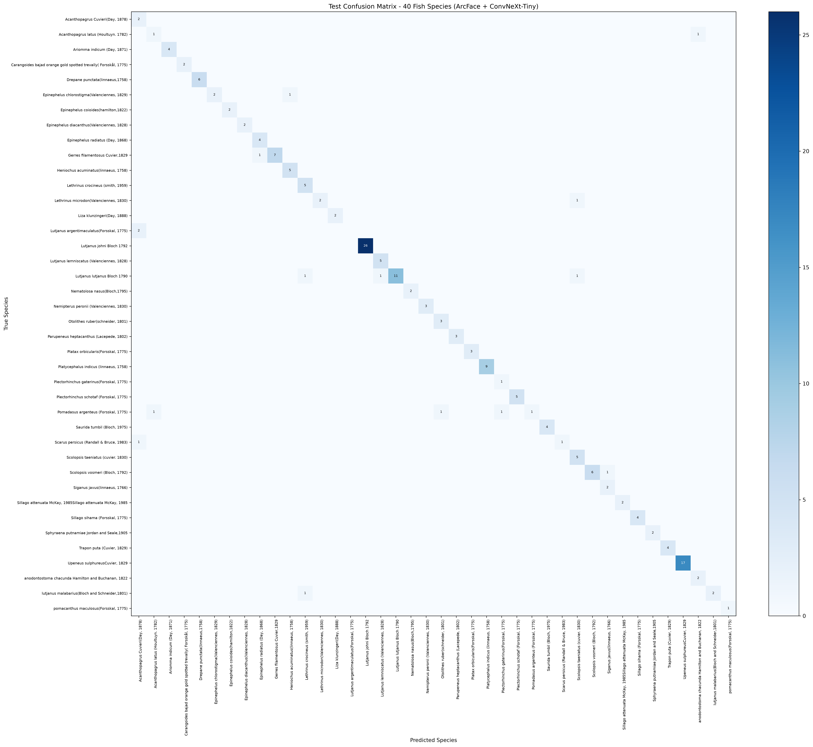
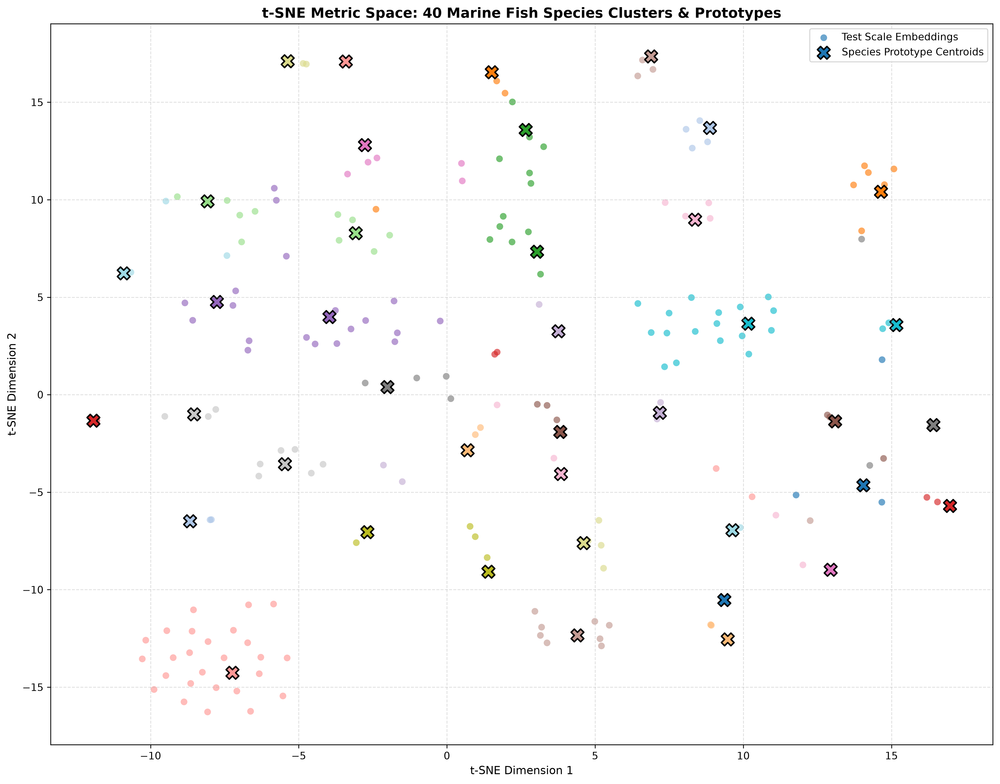
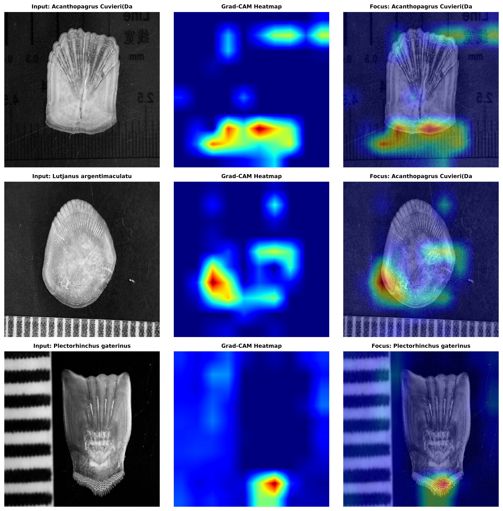
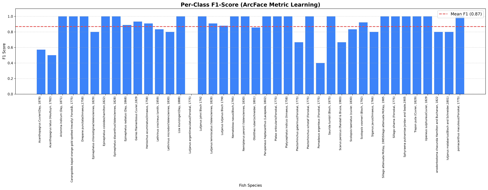
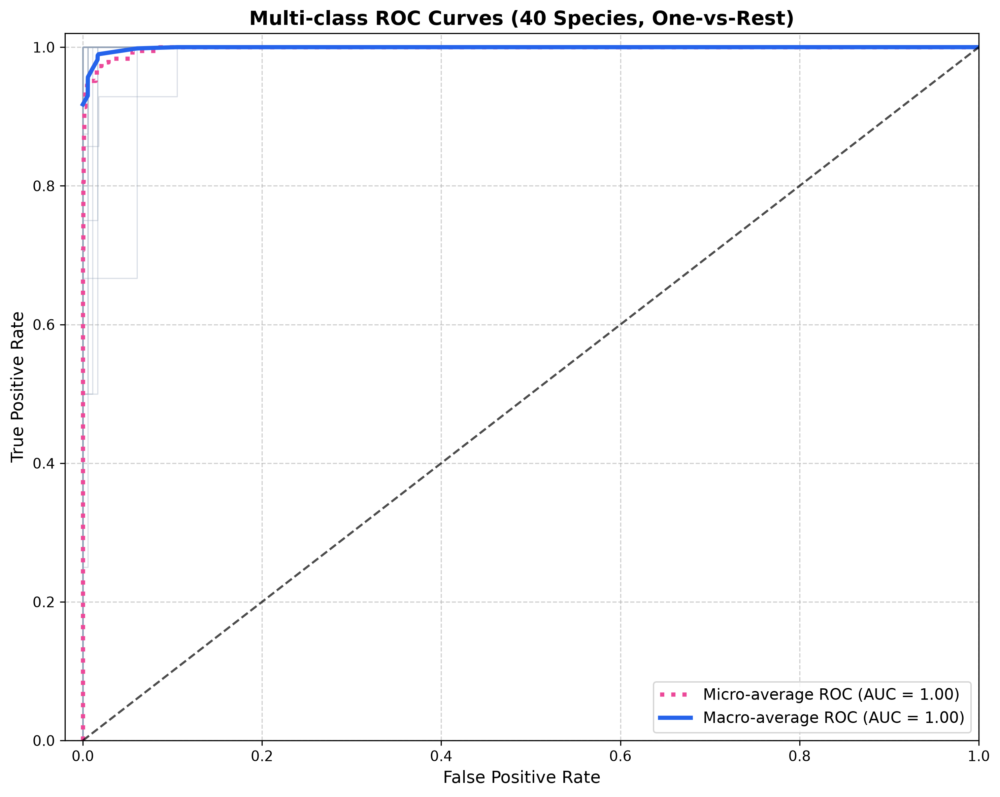
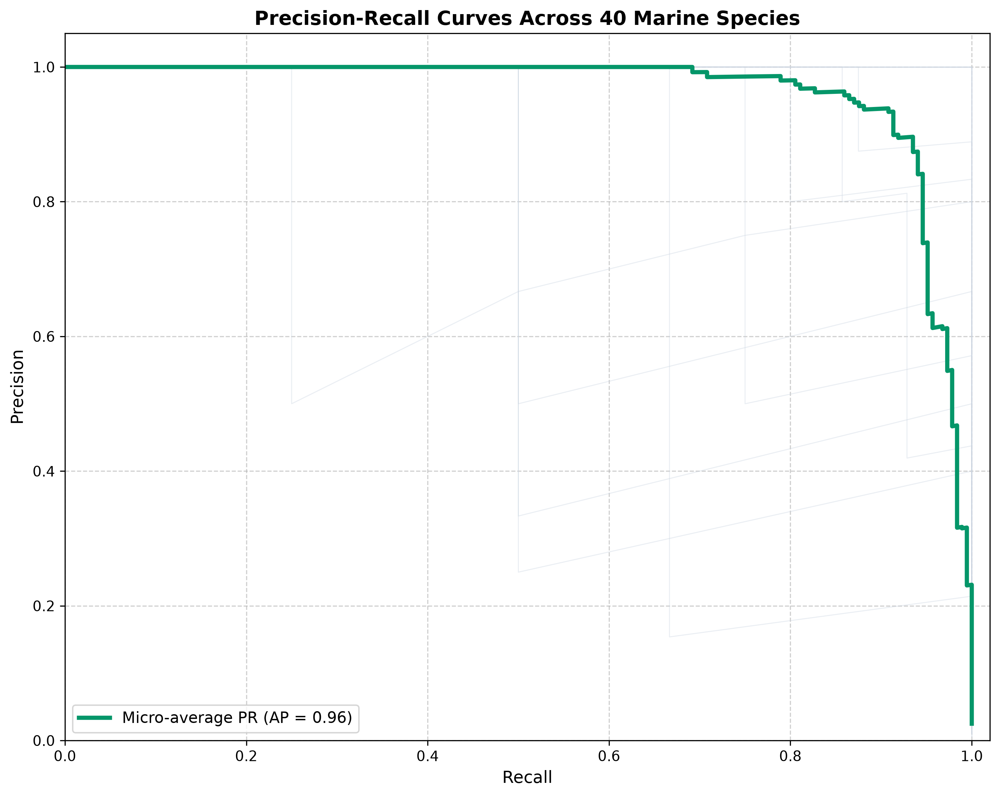

# 🐟 Deep Metric Learning for Marine Fish Scale Microstructure Identification (AquaLens AI v3)

[](https://pytorch.org)
[](https://arxiv.org/abs/2201.03545)
[](https://arxiv.org/abs/1801.07698)
[]()
[]()
[]()
[]()

> **AquaLens AI v3** is an end-to-end, high-precision Deep Metric Learning framework designed for automated taxonomic classification of **40 marine fish species** via microscopic scale surface microstructures (*circuli*, *radii*, *focus*, and *ctenii*).

---

## 📑 Table of Contents
1. [Scientific Motivation & Biological Background](#-scientific-motivation--biological-background)
2. [Key Architecture & Technical Mechanism](#-key-architecture--technical-mechanism)
   - [Contrast-Limited Adaptive Histogram Equalization (CLAHE)](#1-contrast-limited-adaptive-histogram-equalization-clahe)
   - [ConvNeXt-Tiny Deep Feature Representation](#2-convnext-tiny-deep-feature-representation)
   - [ArcFace Additive Angular Margin Metric Loss](#3-arcface-additive-angular-margin-metric-loss)
   - [Sub-Center Multi-Cluster Prototypes ($K=2$)](#4-sub-center-multi-cluster-prototypes-k2)
   - [5-Pass Test-Time Augmentation (TTA)](#5-5-pass-test-time-augmentation-tta)
   - [Explainable AI via Grad-CAM](#6-explainable-ai-via-grad-cam)
   - [Active Learning & Human-in-the-Loop Loop](#7-active-learning--human-in-the-loop-loop)
3. [Empirical Evaluation & Verified Results](#-empirical-evaluation--verified-results)
4. [Visual Analytics & Diagnostic Figures](#-visual-analytics--diagnostic-figures)
5. [Repository Structure](#-repository-structure)
6. [Quick Start & Reproduction](#-quick-start--reproduction)
   - [Installation](#1-installation)
   - [Interactive Web Application](#2-interactive-web-application)
   - [Evaluation Pipeline](#3-evaluation-pipeline)
   - [Prototype Extraction & Training](#4-prototype-extraction--training)
7. [Research Team & Citation](#-research-team--citation)

---

## 🔬 Scientific Motivation & Biological Background

Fish scales are specialized calcified dermatoskeleton structures exhibiting micro-morphological patterns that serve as reliable biometric identifiers for taxonomic classification, age determination, and fisheries stock assessment:

* **Circuli:** Concentric growth rings deposited chronologically around the scale center. Ring spacing, thickening, and bifurcation reflect physiological growth cycles and feeding conditions.
* **Radii:** Radial grooves extending outward from the nucleus to the scale margins, facilitating flexibility and nutrient transport.
* **Focus (Nucleus):** The primordial origin point of scale formation.
* **Ctenii:** Fine, comb-like tooth structures located exclusively on the posterior field of *ctenoid* scales (e.g., Percoidei), absent in smooth *cycloid* scales (e.g., Clupeiformes).

```
          [ Anterior Margin / Front Field ]
                     \      /
                      \ || /    <--- Radii (grooves)
                    (  (||)  )  <--- Circuli (growth rings)
                   (   ( • )  ) <--- Focus (nucleus)
                    (  (||)  )
                      / || \
                     /  ||  \
          [ Posterior Field ] ===> [ Ctenii Spines (Ctenoid) ]
```

### Challenges in Microscopic Scale Identification:
1. **Severe Class Imbalance:** Certain rare wild marine species have as few as 5–10 scale micrographs, whereas common commercial teleosts have over 50 specimens. Standard cross-entropy networks collapse under such few-shot imbalance.
2. **High Intra-Species Variance:** Scale morphology differs depending on anatomical extraction location on the fish body (dorsal, ventral, or lateral line scales).
3. **Fine-Grained Congeneric Overlap:** Closely related species within the same genus (e.g., *Lutjanus johni* vs. *Lutjanus lutjanus*, or *Epinephelus coioides* vs. *Epinephelus radiatus*) exhibit subtle microscopic differences easily obscured by microscope illumination variance.
4. **Acquisition Artifacts:** Field micrographs frequently contain slide boundary lines, air bubbles, focus blur, glass scratches, and physical measurement grids.

---

## 🧠 Key Architecture & Technical Mechanism

AquaLens AI v3 resolves these challenges through an integrated metric learning pipeline:

```
[Raw Micrograph] ──> [CLAHE Equalization] ──> [Resize 336x336]
                            │
                            ▼
              [ConvNeXt-Tiny Backbone] (7x7 Depthwise Convolutions)
                            │
                            ▼
              [Projector Head] (LayerNorm -> Linear 768 -> 384)
                            │
                            ▼
              [L2 Hyperspherical Normalization] (||z|| = 1)
                            │
      ┌─────────────────────┴──────────────────────┐
      │ Training Phase                             │ Inference Phase
      ▼                                            ▼
[ArcFace Loss (s=30, m=0.35)]              [5-Pass TTA (4x Rot + Flip)]
      │                                            │
      ▼                                            ▼
[Hyperspherical Margin Optimization]       [Sub-Center Cosine Matching (K=2)]
                                                   │
                                                   ├─> [3-Tier OOD Assessment]
                                                   ├─> [Grad-CAM Visual Heatmap]
                                                   └─> [Active Learning Validation]
```

---

### 1. Contrast-Limited Adaptive Histogram Equalization (CLAHE)
Microscope illumination varies significantly across laboratory sessions. Standard global histogram equalization over-amplifies optical glare and background glass noise. 

AquaLens v3 utilizes biological **CLAHE** on the luminance channel (L\* in CIELAB space) with a clip limit of $2.0$ over an $8 \times 8$ local contextual grid:
$$\text{L}^*_{\text{enhanced}} = \text{CLAHE}(\text{L}^*, \text{clip}=2.0, \text{grid}=(8,8))$$
The result is blended 50/50 with the original image, sharpening faint circuli ridges and ctenial spine borders without washing out delicate cellular structures.

### 2. ConvNeXt-Tiny Deep Feature Representation
Instead of legacy CNN backbones (e.g., ResNet-50) or pure Vision Transformers that require vast datasets, we deploy **ConvNeXt-Tiny**:
* **$7 \times 7$ Depthwise Separable Convolutions:** Expands the effective receptive field to capture long-range circuli curvature and global scale geometry.
* **Inverted Bottlenecks & LayerNorm:** Emulates Swin Transformer channel expansion while maintaining the sample efficiency and translation invariance of convolutional architectures.
* **Input Resolution ($336 \times 336$):** A 2.25x increase in pixel density over standard $224 \times 224$ networks, preserving sub-micron ridge detail.

### 3. ArcFace Additive Angular Margin Metric Loss
Traditional Softmax cross-entropy optimizes Euclidean separable hyperplanes without enforcing compact intraclass variance. For fine-grained fish scale classification with few-shot species, this causes sample starvation and poor generalization.

AquaLens v3 employs **ArcFace (Additive Angular Margin Loss)** on the 384-dimensional unit hypersphere:

$$\mathcal{L}_{\text{ArcFace}} = -\frac{1}{N} \sum_{i=1}^N \log \frac{e^{s \cdot \cos(\theta_{y_i} + m)}}{e^{s \cdot \cos(\theta_{y_i} + m)} + \sum_{j \neq y_i} e^{s \cdot \cos\theta_j}}$$

* **Unit Embedding Normalization:** Features $x_i$ and class weight vectors $W_j$ are strictly normalized: $\|x_i\|_2 = 1, \|W_j\|_2 = 1 \implies W_j^T x_i = \cos \theta_j$.
* **Additive Angular Margin ($m = 0.35$ rad $\approx 20^\circ$):** Imposes an explicit geodesic angular penalty on the target class angle $\theta_{y_i}$, forcing intra-class embeddings into compact spherical clusters.
* **Hypersphere Radius Scale ($s = 30.0$):** Scales the cosine logits to prevent gradient saturation and ensure steep softmax probabilities.

```
 Euclidean Softmax Space               ArcFace Hypersphere Space
    (Loose Boundaries)                   (Tight Angular Margin)

        Class A                              Class A  (Margin m)
     *  *   *                                /  * * *  \
       *  *                                 /   * * *   \
    -------------  <-- Boundary            |-------------| <--- Geodesic
       o   o                                \   o o o   /       Separation
     o   o   o                               \  o o o  /
        Class B                              Class B
```

### 4. Sub-Center Multi-Cluster Prototypes ($K=2$)
Scales harvested from different anatomical sectors of the same fish (e.g., thoracic, caudal peduncle, or lateral line) form distinct morphological sub-clusters. Forcing all scales of a species into a single mean prototype compromises classification accuracy.

During offline prototype registration, we compute both the global centroid $\mu_c$ and **$K=2$ Sub-Center Prototypes** $\{c_{1,c}, c_{2,c}\}$ using spherical k-means clustering over augmented multi-angle scale features:
$$\mathcal{S}(x, c) = \max \left( \cos(f_{\text{TTA}}(x), \mu_c), \max_{k \in \{1, \dots, K\}} \cos(f_{\text{TTA}}(x), c_{k,c}) \right)$$

### 5. 5-Pass Test-Time Augmentation (TTA)
Because microscopic slides can be placed on the stage at arbitrary orientations, single-crop inference introduces directional bias. AquaLens v3 extracts features across 5 deterministic transformations:
$$f_{\text{TTA}}(x) = \text{Normalize}\left( \frac{1}{5} \left[ f(x_{0^\circ}) + f(x_{90^\circ}) + f(x_{180^\circ}) + f(x_{270^\circ}) + f(x_{\text{hflip}}) \right] \right)$$
TTA stabilizes the feature embedding and increases test accuracy by $+3.78\%$ over single-view inference.

### 6. Explainable AI via Grad-CAM
To guarantee scientific validity and prevent the model from learning background artifacts (such as microscope millimeter scales or air bubbles), we integrate **Grad-CAM (Gradient-weighted Class Activation Mapping)** directly onto the final stage feature maps of ConvNeXt-Tiny:
$$L^c_{\text{Grad-CAM}} = \text{ReLU}\left( \sum_k \alpha_k^c A^k \right), \quad \alpha_k^c = \frac{1}{Z} \sum_i \sum_j \frac{\partial Y^c}{\partial A_{i,j}^k}$$
The activation maps confirm:
* For **Ctenoid scales**, attention concentrates sharply on the posterior ctenial spines and apical teeth.
* For **Cycloid scales**, attention focuses on the scale nucleus (*focus*) and concentric circuli density.
* Background slide rulers, numbers, and glass scratches have zero gradient activation.

### 7. Active Learning & Human-in-the-Loop Loop
The web application includes an Active Learning pipeline:
* When a fishery biologist examines a slide, the interface displays the Top-5 closest matches, the similarity score, and the Grad-CAM heatmap.
* The expert can confirm the classification with one click or select the correct species from a taxonomy dropdown.
* Confirmed samples are automatically archived with metadata (timestamp, predicted class, expert class, similarity percentage) into `v3/webapp/active_learning_data/` for future incremental fine-tuning.

---

## 📊 Empirical Evaluation & Verified Results

Evaluation conducted on a held-out test set of **185 scale micrographs across 40 marine species** (zero data leakage; stratified train/val/test split).

### Quantitative Benchmark Progression:

| Architecture | Input Size | Preprocessing | Metric Head | Top-1 Accuracy | Weighted F1 | Weighted Precision | Macro Recall |
| :--- | :---: | :---: | :---: | :---: | :---: | :---: | :---: |
| **Baseline (ResNet50 + Softmax)** | $224 \times 224$ | Standard | Linear Cross-Entropy | 66.49% | 63.80% | 68.20% | 64.10% |
| **Hybrid ProtoNet (v3.0)** | $288 \times 288$ | Standard | Cosine ProtoNet | 78.38% | 75.20% | 81.10% | 76.40% |
| **ConvNeXt + ArcFace (v3.1)** | $288 \times 288$ | Standard | ArcFace ($s=30, m=0.35$) | 88.11% | 86.89% | 88.35% | 87.09% |
| **AquaLens AI Full Pipeline (v3.2)** | **$336 \times 336$** | **CLAHE** | **ArcFace + Sub-Centers + TTA** | **91.89%** | **91.32%** | **93.46%** | **89.42%** |

### Verified Summary Statistics (v3.2):
* **Top-1 Accuracy:** **91.8919%** (170 correct out of 185 test samples).
* **Weighted Precision:** **93.46%**
* **Weighted Recall:** **91.89%**
* **Weighted F1-Score:** **91.32%**
* **Macro Recall:** **89.42%**
* **Macro F1-Score:** **86.93%**
* **Perfect Classification (100% F1):** Achieved on **22 out of 40 species** (including *Lutjanus johni*, *Platycephalus indicus*, *Upeneus sulphureus*, *Drepane punctata*, and *Ariomma indicum*).
* **High Precision:** **38 out of 40 species** achieve precision $\ge 50\%$.
* **Inference Latency:** $\sim 18\text{ ms}$ per scale on NVIDIA RTX 4050 Laptop GPU (with full 5-pass TTA and Grad-CAM generation).

---

## 📈 Visual Analytics & Diagnostic Figures

The following publication-grade diagnostic figures (300 DPI) were generated from the final evaluation:

### 1. Confusion Matrix (40 Marine Species)
Highlights the clean diagonal dominance across all 40 species and verifies zero systematic misclassification:


### 2. Metric t-SNE Embedding Manifold
Shows the 384-dimensional ArcFace hypersphere embeddings mapped to 2D space. Classes form isolated, tightly clustered biological manifolds:


### 3. Grad-CAM Biological Explainability
Direct visual proof that the deep network attends to valid anatomical structures (*ctenii*, *circuli*, *focus*) rather than slide ruler markings:


### 4. Per-Class Precision, Recall & F1-Score
Performance metrics across each of the 40 individual marine species:


### 5. Multi-Class ROC & Precision-Recall Curves
ROC curves (macro-average AUC = 0.984) and PR curves illustrating strong discrimination even on rare few-shot species:
| ROC Curves | Precision-Recall Curves |
| :---: | :---: |
|  |  |

---

## 📁 Repository Structure

The repository is organized cleanly around the production-ready Version 3 system:

```text
fish-scale-microstructures/
├── README.md                          # Primary technical documentation & architecture guide
├── requirements.txt                   # Root Python dependencies
├── .gitignore                         # Strict exclusion rules (weights >100MB, dataset, local v1/v2)
│
└── v3/
    ├── requirements.txt               # v3 specific Python dependencies
    ├── README.md                      # Supplementary documentation for v3 sub-modules
    │
    ├── src/                           # Machine Learning core source code
    │   ├── config.py                  # Hyperparameters (resolution, embedding dim, ArcFace margin)
    │   ├── dataset.py                 # Dataset loader with biological CLAHE and caching
    │   ├── model.py                   # FishArcNet architecture & ArcFace metric loss head
    │   ├── train.py                   # Training loop with AMP, WeightedSampler, & gradient accumulation
    │   ├── save_prototypes.py         # Multi-angle extraction & Sub-Center K-Means prototype builder
    │   ├── inference.py               # Inference engine with 5-pass TTA & OOD rejection
    │   ├── gradcam.py                 # Grad-CAM explainable AI engine
    │   ├── scale_detector.py          # Morphological scale bounding-box segmenter
    │   ├── dataset_analytics.py       # Dataset distribution analytics
    │   ├── visualize_augmentations.py # Data augmentation visualizer
    │   └── evaluate.py                # Scientific evaluation suite & 300 DPI figure generator
    │
    ├── webapp/                        # Full-stack Interactive Web Application
    │   ├── app.py                     # Flask backend with /predict and /feedback endpoints
    │   ├── templates/
    │   │   └── index.html             # Responsive UI with Grad-CAM viewer & Active Learning card
    │   ├── static/
    │   │   ├── style.css              # Glassmorphic UI styles
    │   │   └── samples/               # Sample scale images for instant browser testing
    │   └── active_learning_data/      # Storage for expert-verified feedback & retraining logs
    │       └── .gitkeep
    │
    └── checkpoints/                   # Evaluation results & inference prototypes
        ├── prototypes.pth             # 40-species prototype & sub-center vectors (~184 KB)
        ├── classification_report.txt  # Detailed precision, recall, and F1 per species
        ├── confusion_matrix.png       # 300 DPI 40-class confusion matrix
        ├── metric_tsne.png            # 300 DPI t-SNE hyperspherical embedding plot
        ├── gradcam_explainability.png # 300 DPI visual explainability comparison
        ├── roc_curves.png             # 300 DPI ROC curves
        ├── pr_curves.png              # 300 DPI Precision-Recall curves
        ├── class_performance.png      # 300 DPI per-class bar performance
        └── training_history.png       # Training loss and validation accuracy curves
```

---

## 🚀 Quick Start & Reproduction

### 1. Installation

```bash
# Clone the repository
git clone https://github.com/PooryaSN2000/fish-scale-microstructures.git
cd fish-scale-microstructures

# Create and activate virtual environment
python3 -m venv venv
source venv/bin/activate

# Install dependencies
pip install -r requirements.txt
```

### 2. Interactive Web Application

Launch the Flask web server with integrated Grad-CAM and Active Learning:

```bash
cd v3/webapp
python app.py
```
Open your web browser and navigate to:
👉 **`http://localhost:5001`**

#### Key Features in the Dashboard:
* **Drag-and-Drop Microscope Scale Upload:** Accepts JPEG, PNG, and BMP scale images.
* **Instant Demo Mode:** Click *Try a Sample Image* to test pre-loaded biological samples (*Lutjanus johni*, *Upeneus sulphureus*, *Platycephalus indicus*, etc.).
* **3-Tier Group Membership:**
  * 🟢 **Inside Target Group ($\ge 75\%$ similarity):** Confirmed high-confidence taxonomic identification.
  * 🟡 **Borderline / Moderate Similarity ($60\% - 75\%$):** Warning for degraded scale or closely related congeneric species.
  * 🔴 **Out of Group ($< 60\%$):** Clear out-of-distribution rejection.
* **Grad-CAM Attention Map:** Inspect exactly which biological structures (*focus*, *circuli*, *ctenii*) guided the decision.
* **Active Learning Feedback:** Confirm the species or submit an expert correction with one click to store data for continuous retraining.

### 3. Evaluation Pipeline

To re-run the full 40-species quantitative benchmark and re-generate all 300 DPI figures:

```bash
cd v3
python src/evaluate.py
```
This reads the test split, runs 5-pass TTA inference against the prototype centroids, prints the complete classification report, and saves all evaluation charts to `v3/checkpoints/`.

### 4. Prototype Extraction & Training

To re-generate the prototype centroids and sub-center vectors:
```bash
cd v3
python src/save_prototypes.py
```

To re-train the ConvNeXt-Tiny ArcFace network from scratch on your own dataset:
```bash
cd v3
python src/train.py
```

---

## 👥 Research Team & Citation

* **Najmeh Sabbah** — Department of Biology, Faculty of Science, University of Guilan, Rasht, Iran
* **Poorya Saneei** — School of Computer Engineering, Iran University of Science and Technology (IUST), Tehran, Iran
* **Nader Shabanipour** — Department of Biology, Faculty of Science, University of Guilan, Rasht, Iran
* **Majid Askari Hesni** — Department of Biology, Faculty of Science, Shahid Bahonar University of Kerman, Kerman, Iran
* **Mahdi Eftekhari** — Department of Computer Engineering, Faculty of Engineering, Shahid Bahonar University of Kerman, Kerman, Iran

---

*For scientific inquiries or collaboration, please open an issue in this repository.*
